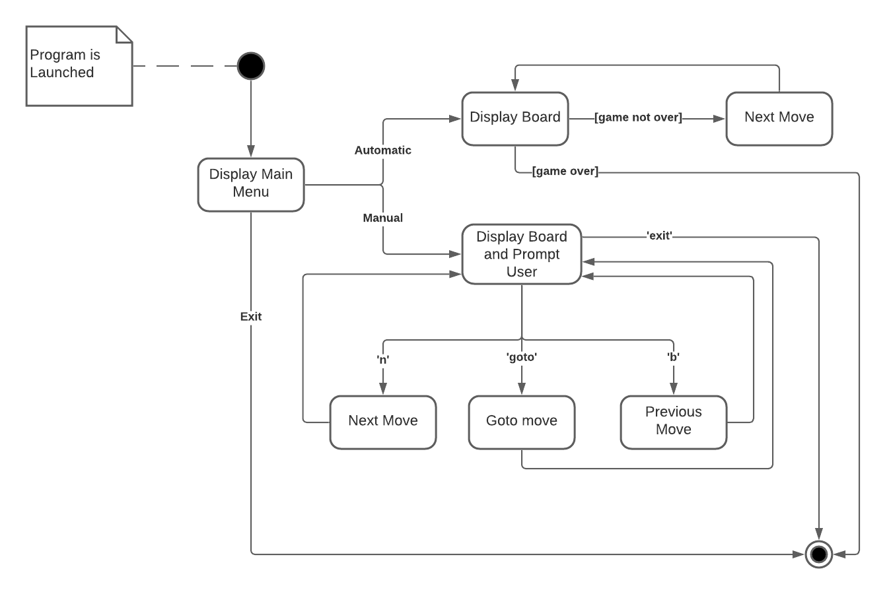
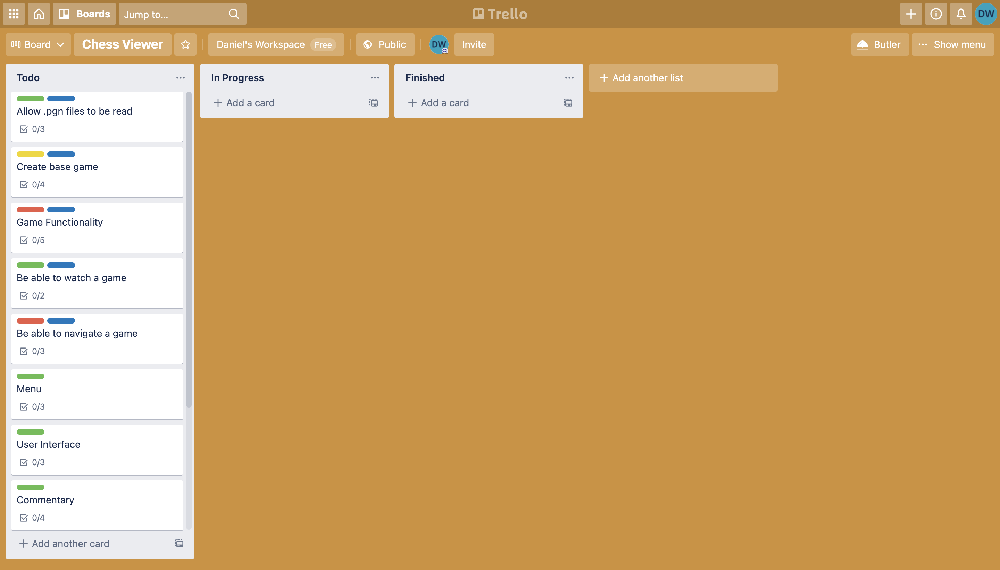
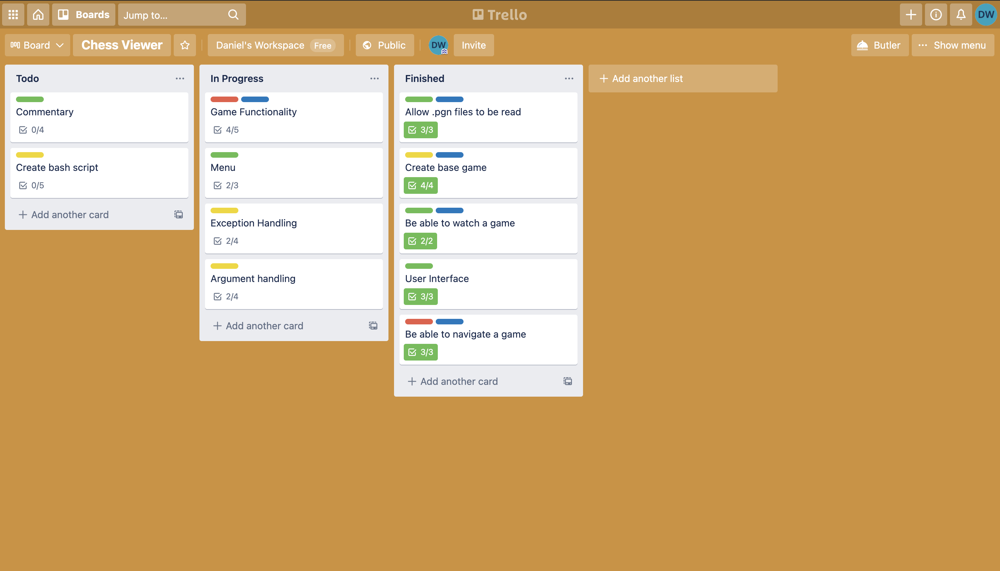
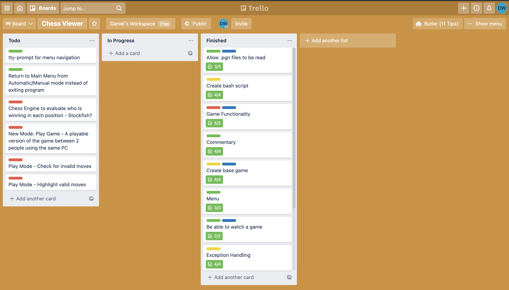

# Chess Viewer
*Visit the Github repo [here](https://github.com/daniel-walters/chess-viewer)*  
## Software Development Plan
---
### <ins>Purpose and Scope:</ins>
This application uses Chess Portable Game Notation (.PGN) files to re-create the game to be viewed on an ascii chess board within the terminal. It has an automatic mode where the user can watch the whole game play out, and a manual mode, where the user can move to the next or previous move in the game at their own convenience. In manual mode they can also fast forward or rewind to a particular move of their choice.

Each mode also displays a basic commentary on each move, showing what piece moved, to and from what square on the board, as well as information on any captures, promotions, checks and checkmates.

Chess notation is rather hard to follow if you can't visualize the board, this app solves that problem by displaying each move on a chess board. 

The target audience for the application are those with any interest in the game of chess. It allows for them to watch any recorded game of chess within their terminal.
### <ins>Features:</ins>  
- #### <ins>Feature 1: Read PGN from file  </ins>
    Using a combination of gems the app reads a .pgn file and converts it into JSON format. A default, valid .pgn is given with the app which the program will default to if no path is given as an argument, or an error is encountered with the given path. The program is designed this way to avoid crashes if the file is not found or is of an invalid format. The JSON formatted file is then stored as a hash in the FileReader class.
- #### <ins>Feature 2: Read PGN moves to display on a chess board</ins>  
    A chess board is created out of a 2D array of Squares. Each Square can have a Piece, and the board is set up as per a normal game of chess. The Hash of chess moves contains information of what square a piece started on and ended on on any given turn. Using this information, the app moves a piece from one square to another on the array and displays the array in a format that represents a chess board. Using other information stored in the JSON the program can accurately represent castling, captures, promotion, and en passant. 
- #### <ins>Feature 3: Navigate the game move by move or by skipping to a move</ins>  
    In 'manual' mode the application continually awaits input until it is exited. Based on the input the program either goes to the next move, previous move, or a move specified by the user. If the given move does not exist, the error is caught and an appropriate message is displayed before the user is asked for input again. The program is designed this way to avoid crashes when given bad input, or when trying to go to the next move at the end of the game/trying to go to the previous move at the beginning of the game.

### <ins>User Interaction and Experience</ins>  
#### <ins> Running the Program</ins>
Basic information on how to use the program can be viewed by running index.rb with the --help or -h flag.  
> i.e. ruby index.rb -h OR ruby index.rb --help 

A more detailed explanation for running the program will be detailed below in the Help Documentation Section  
#### <ins>Using the Program</ins>
Once the program has launched the user will be prompted to enter automatic mode, manual mode, or exit. This choice can be made by typing the corresponding number. 

><ins>Automatic Mode</ins>  
The program will play through the chess game automatically and exit once finished.  

><ins>Manual Mode</ins>  
The user will be prompted to type 'n' for next move, 'b' for previous move, 'goto' to specify a move, or 'exit' to exit the program.  
If 'goto' is chosen, the user will be once more prompted, this time for a move to go to. Once a new move has been selected either with 'n', 'b', or 'goto', the game will show that move and the user will be prompted for their next decision until they type exit.  
***NOTE:*** When selecting 'goto', moves must be entered in the format of '[turn][player_to_move]'. I.e. To goto whites move on turn 5, the user must input '5w' when prompted to enter a move.

### <ins>Control Flow Diagram:</ins>  

### <ins>Implementation Plan:</ins> 
*View the trello board for this project [here](https://trello.com/b/lk1aeFoo/chess-viewer)*  

Guide:
- Blue: MVP
- Green: Easy
- Yellow: Medium
- Red: Hard

Screenshots:

Beginning of Project:

Mid-way through devlopment:

Progress as of 23/05/2021:
  

First Release with possible future features added (26/05/2021)

### <ins>Help Documentation:</ins>  
NOTE: Please install the ruby gem bundler before using the program:
> gem install bundler  

NOTE: If not using the bash script described below, please install the relevant gems needed for the application by running:
> bundle install  

The index.rb file can be run with the following commands:  
- '-p [path_to_pgn]' OR '--path [path_to_pgn]'  
This will load the given pgn file into the application
- '-t [seconds_between_moves]' OR '--time [seconds_between_moves]'  
This will set how many seconds the program will wait between moves in automatic mode.

Alternatively the index.rb file can be run without one of any of these flags. If no path is specified, the default game will be loaded. If no time is specified, it will default to 3 seconds.

#### <ins>Mac and Linux Users</ins>
Mac and Linux users can run the chess viewer bash script with
> ./chess_viewer.sh  

This bash script will take the user through installation and help with passing arguments to index.rb.
